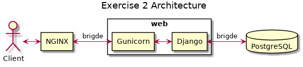

# CODE TEST <!-- omit in toc -->

This repository stores a code test compose of two exercises to demonstrate skills mainly with [Python], [Django], [Gunicorn], [NGINX], [PostgreSQL], [Docker], [Jupyter Notebook], [microservices] and [REST API].

- [DEPENDENCIES](#dependencies)
- [CODE TEST CONTENT](#code-test-content)
- [EXERCISE 1: PYTHON](#exercise-1-python)
  - [EXERCISE 1 REQUIREMENTS](#exercise-1-requirements)
  - [EXERCISE 1 NOTES](#exercise-1-notes)
  - [EXERCISE 1 FOLDER CONTENT](#exercise-1-folder-content)
  - [HOW TO RUN EXERCISE 1](#how-to-run-exercise-1)
- [EXERCISE 2: DATA & API TEST](#exercise-2-data--api-test)
  - [EXERCISE 2 REQUIREMENTS](#exercise-2-requirements)
  - [EXERCISE 2 NOTES](#exercise-2-notes)
  - [BONUS](#bonus)
  - [EXERCISE 2 FOLDER CONTENT](#exercise-2-folder-content)
  - [EXERCISE 2 ARCHITECTURE](#exercise-2-architecture)
  - [HOW TO RUN EXERCISE 2 **WITH DOCKER COMPOSE**](#how-to-run-exercise-2-with-docker-compose)
  - [HOW TO RUN EXERCISE 2 **WITHOUT DOCKER COMPOSE**](#how-to-run-exercise-2-without-docker-compose)
- [CREDITS](#credits)

## DEPENDENCIES

The code has been tested using:

* [Python] (3.8): an interpreted high-level programming language for general-purpose programming.
* [Jupyter Lab] (3.0.12): a web-based interactive development environment for [Jupyter Notebooks], code and data.
* [Django] (3.1.7): a high-level [Python] Web framework that encourages rapid development and clean, pragmatic design.
* [Gunicorn] (20.0.4): a [Python] [WSGI] HTTP Server for UNIX.
* [NGINX] (1.19.8): a free, open-source, high-performance HTTP server, reverse proxy, and IMAP/POP3 proxy server.
* [PostgreSQL] (13.2): an object-relational database management system (ORDBMS) with an emphasis on extensibility and standards compliance.
* [Docker] (19.03.13-ce): an open platform for developers and sysadmins to build, ship, and run distributed applications, whether on laptops, data center VMs, or the cloud.
* [Docker-Compose] (1.28.5): a tool for defining and running multi-container [Docker] applications.

Virtual environment (<env_name>=**codetest38**) can be generated with **requirements.txt** file found in codetest main folder.

Command to configure virtual environment with [venv]:

```bash
~/codetest$ python -m venv codetest38
~/codetest$ source codetest38/bin/activate
(codetest38)~/codetest$ pip install pip==21.0.1
(codetest38)~/codetest$ pip install setuptools==54.1.2
(codetest38)~/codetest$ pip install -r requirements.txt
```

## CODE TEST CONTENT

Codetest main folder contains two folders for Exercise 1 and Exercise 2.

```bash
codetest
├── exercise1
├── exercise2
├── README.md
└── requirements.txt
```

## EXERCISE 1: PYTHON

### EXERCISE 1 REQUIREMENTS

Write a small app that takes an integer and return a string representation of that integer with commas separating
groups of 3 digits. For example:

```python
print translate (1234)
'1,234'
print translate (123456789)
'123,456,789'
```

### EXERCISE 1 NOTES

• Use [Python] as programming language.

• Input/output methods doesn’t matter.

### EXERCISE 1 FOLDER CONTENT

The **exercise1** folder contains three files:

* **function.py**: It contents translate functions code for Exercise 1 including one solution with regular expression.

* **main.py**: It is used to test translate functions.

* **Exercise1.ipynb**: [Jupyter Notebook] to test translate functions.

```bash
exercise1
├── docs
├── Exercise1.ipynb
├── function.py
└── main.py
```

### HOW TO RUN EXERCISE 1

The way to run Exercise 1 is simple. Just go to **exercise1** folder and execute:

```bash
(codetest38)~/codetest/exercise1$ python main.py
```

A good way to play with the **translate** and **translate_regex** functions is through a [Jupyter Lab]. One notebook is stored in the same **exercise1** folder, to run it use the command shown below:

```bash
(codetest38)~/codetest/exercise1$ jupyter lab Exercise1.ipynb
```


## EXERCISE 2: DATA & API TEST

### EXERCISE 2 REQUIREMENTS

Write a small app that publish an [REST API] with these endpoints using data from **test.xml**:

• Give me 20 products ordered by price.

• Give me 20 products ordered by discount (price - custom_label_0).

• Give me the most discounted 20 products.

• Give me all products under the “Comedy” product type.

### EXERCISE 2 NOTES

• Use [Python] as programming language ([Django] framework preferred).

• Don’t waste time in how consume the API or in the authentication. If it can be tested with Curl or Requests, is totally valid.

### BONUS

• Use [docker-compose] to setup and run the [Django]/[PostgreSQL] app.

### EXERCISE 2 FOLDER CONTENT

The **exercise2** folder contains:

```bash
exercise2
├── docker-compose.yml
├── docs
├── mysite
│   ├── .env.example
│   ├── Dockerfile
│   ├── manage.py
│   ├── mysite
│   │   ├── __init__.py
│   │   ├── settings.py
│   │   ├── urls.py
│   │   ├── wsgi.py
│   ├── products
│   │   ├── admin.py
│   │   ├── apps.py
│   │   ├── __init__.py
│   │   ├── models.py
│   │   ├── serializers.py
│   │   ├── tests.py
│   │   ├── urls.py
│   │   ├── views.py
│   └── requirements.txt
├── nginx
│   └── conf.d
│       └── local.conf
└── postgresql
    ├── codetest.sql
    ├── Dockerfile
    ├── importer.py
    └── test.xml
```

* **docker-compose.yml**: creates the [Django] and [PostgreSQL] [Docker] containers in which the applications shall run.

* **docs**: It stores Exercise 2 documentation.

* **mysite**: It stores [Django]'s **products** app code.

* **nginx**: It stores [NGINX]'s configuration.

* **postgresql**: It stores the **test.xml** with data to be inserted into [PostgreSQL] and the **importer** app to do this process.

### EXERCISE 2 ARCHITECTURE

The architecture created with [docker-compose] uses three different [Docker] containers for:

* [NGINX].
* [Django] and [Gunicorn].
* [PostgreSQL].

The following diagram illustrates the architecture in blocks:



### HOW TO RUN EXERCISE 2 **WITH DOCKER COMPOSE**

The steps and commands to run Exercise 2 with [docker-compose] are described below.

First create environment **.env** file using **.env.example** file as template inside **mysite** folder. Exercise 2 should run fine with default template settings.

Then [docker-compose] can be executed to build services.

```bash
~/codetest/exercise2$ docker-compose build
```

Next step consists in executing [docker-compose] up command.

```bash
~/codetest/exercise2$ docker-compose up
```

It is possible that for the first time the command keeps stopped at one point as shown below:

```bash
...
postgres_db_1_81cb47c30feg | 2018-12-11 09:59:15.676 UTC [42] ERROR:  role "postgres" does not exist
postgres_db_1_81cb47c30feg | 2018-12-11 09:59:15.676 UTC [42] STATEMENT:  REVOKE ALL ON SCHEMA public FROM postgres;
exercise2_postgres_db_1_81cb47c30feg exited with code 3
```

If this happens simply press 'Control+C', wait patiently to return to shell and repeat again the same command. If everything goes fine at the end it should appear something similar to:

```bash
...
postgres_db_1_81cb47c30feg | 2018-12-11 09:59:27.670 UTC [1] LOG:  database system is ready to accept connections
```

There are different ways to check that the server is running properly. One is opening a web browser such as Chrome or Firefox and paste the following URL:

```bash
http://127.0.0.1/products/
```

The web browser should show something similar to:

```bash
HTTP 200 OK
Allow: GET, HEAD, OPTIONS
Content-Type: application/json
Vary: Accept

{
    "price": "http://127.0.0.1/products/price/",
    "discount": "http://127.0.0.1/products/discount/",
    "mostdiscounted": "http://127.0.0.1/products/mostdiscounted/",
    "typecomedy": "http://127.0.0.1/products/typecomedy/"
}
```

The description of the URLs that are above:

* "price" URL: Gets 20 products ordered by price.

```bash
HTTP 200 OK
Allow: GET, POST, HEAD, OPTIONS
Content-Type: application/json
Vary: Accept

[
    {
        "product_id": "AF5TW2",
        "title": "Maxi-Cosi - AxissFix Autostol (61-105 cm)",
        "product_type": "Car Seats > Child car seats > Child benefit",
        "price": "3299.00",
        "custom_label_0": "3135.00"
    },
    {
        "product_id": "AN3WT9",
        "title": "Maxi-Cosi - AxissFix Autostol (61-105 cm)",
        "product_type": "Car Seats > Child car seats > Child benefit",
        "price": "3299.00",
        "custom_label_0": "3135.00"
    },
    ...
    ...
    ...
    {
        "product_id": "AG286U",
        "title": "Maxi-Cosi - Citi Autostol (0-13 kg)",
        "product_type": "Car Seats > Child car seats > Child benefit",
        "price": "890.00",
        "custom_label_0": "846.00"
    }
]
```

* "discount" URL: Gets 20 products ordered by discount (price - custom_label_0).

```bash
HTTP 200 OK
Allow: GET, POST, HEAD, OPTIONS
Content-Type: application/json
Vary: Accept

[
    {
        "product_id": "AF84CU",
        "title": "Sisley - Daily Line Reducer 30 ml",
        "product_type": "Skincare > Face > Oils & Serums",
        "price": "2399.00",
        "custom_label_0": "2199.00"
    },
    {
        "product_id": "AD529V",
        "title": "Maxi-Cosi - AxissFix Autostol (61-105 cm)",
        "product_type": "Car Seats > Child car seats > Child benefit",
        "price": "3299.00",
        "custom_label_0": "3135.00"
    },
    ...
    ...
    ...
    {
        "product_id": "AJ79SB",
        "title": "Escentric Molecules - Escentric 04 EDT 100 ml",
        "product_type": "Perfume > Eau de Toilette",
        "price": "679.00",
        "custom_label_0": "612.00"
    }
]
```

* "mostdiscounted" URL: Gets the most discounted 20 products.

```bash
HTTP 200 OK
Allow: GET, POST, HEAD, OPTIONS
Content-Type: application/json
Vary: Accept

[
    {
        "product_id": "AJ43CN",
        "title": "Grusomme mig 2 - DVD",
        "product_type": "Movies > DVD > Standard > Adventure > 7",
        "price": "69.00",
        "custom_label_0": "29.00"
    },
    {
        "product_id": "AF75JP",
        "title": "Marley & Me - DVD",
        "product_type": "Movies > DVD > Standard > Comedy > Owen Wilson > 7",
        "price": "69.00",
        "custom_label_0": "29.00"
    },
    ...
    ...
    ...
    {
        "product_id": "AC8M7R",
        "title": "Melton - Numbers Rib Drenge Boxershorts 2 pk",
        "product_type": "Apparel & Accessories > Clothing",
        "price": "99.00",
        "custom_label_0": "59.00"
    }
]
```

* "typecomedy" URL: Gets all products under “Comedy” product type.

```bash
HTTP 200 OK
Allow: GET, POST, HEAD, OPTIONS
Content-Type: application/json
Vary: Accept

[
    {
        "product_id": "AK628C",
        "title": "Men in Black 3 (3D Blu-Ray)",
        "product_type": "Movies > 3D Blu-Ray > Standard > Comedy > Will Smith",
        "price": "109.00",
        "custom_label_0": "79.00"
    },
    {
        "product_id": "AC39B4",
        "title": "Men in Black 3 (4K Blu-Ray)",
        "product_type": "Movies > 4K Blu-Ray > Standard > Comedy > Will Smith",
        "price": "269.00",
        "custom_label_0": "229.00"
    },
    ...
    ...
    ...
    {
        "product_id": "AF52KX",
        "title": "Glee: Hele Sæson 5 (6-disc) - DVD",
        "product_type": "TV Series > DVD > Complete Edition > Comedy > Lea Michele > 15",
        "price": "109.00",
        "custom_label_0": "69.00"
    }
]
```

### HOW TO RUN EXERCISE 2 **WITHOUT DOCKER COMPOSE**

Please note that this procedure requires having a running [PostgreSQL] database accesible locally through 5432 port on your system. [Django] is used directly without employing [NGINX] or [Gunicorn].

First create environment **.env** file using **.env.example** file as template inside **mysite** folder. Make sure that *POSTGRES_HOST=postgres_db* line is commented in **.env** or assign the value to *POSTGRES_HOST=127.0.0.1*.

As next step to be able to run Exercise 2 is mandatory to create in [PostgreSQL] an user called *'codetest'* with password *'codetest'* and a database *'codetest'*.

The user and the database can be created with the following commands from shell.

```bash
~$ sudo -u postgres bash -c "psql -c \"CREATE USER codetest WITH PASSWORD 'codetest';\""
~$ sudo -u postgres bash -c "psql -c \"CREATE DATABASE codetest WITH OWNER codetest;\""
```

Load .env file with activated virtual environment (codetest38).

```bash
(codetest38)~/codetest/exercise2$ export $(grep -v '^#' .env | xargs -d '\n')
```

The next step consists in executing the following commands to prepare the [Django]'s **products** app.

```bash
(codetest38)~/codetest/exercise2/mysite$ python manage.py migrate
...
(codetest38)~/codetest/exercise2/mysite$ python manage.py makemigrations products
...
(codetest38)~/codetest/exercise2/mysite$ python manage.py sqlmigrate products 0001
BEGIN;
--
-- Create model Product
--
CREATE TABLE "products_product" ("id" serial NOT NULL PRIMARY KEY, "product_id" varchar(10) NOT NULL, "title" varchar(100) NOT NULL, "product_type" varchar(100) NOT NULL, "price" numeric(6, 2) NOT NULL, "custom_label_0" numeric(6, 2) NOT NULL);
COMMIT;
```

It is possible to use [Python] shell for checking [Django] configuration:

```bash
~/mysite$ python manage.py shell
In [1]: from django.conf import settings
In [2]: print(settings.BASE_DIR)
/mysite
```

To import the database **codetest.sql** file containing the table **products_product** with all products to [PostgreSQL] it is necessary to execute:

```bash
(codetest38)~/codetest/exercise2/postgresql$ cp codetest.sql /tmp
(codetest38)~/codetest/exercise2/postgresql$ sudo -u postgres psql codetest < '/tmp/codetest.sql'
```

The **codetest.sql** file was created after running the importer to insert data from **test.xml** file to [PostgreSQL] **products_product** table.

```bash
(codetest38)~/codetest/exercise2/postgresql$ python importer.py
(codetest38)~/codetest/exercise2/postgresql$ pg_dump -U postgres codetest -h localhost > /tmp/codetest.sql
(codetest38)~/codetest/exercise2/postgresql$ cp /tmp/codetest.sql codetest.sql
```

Now it is possible to launch the server with [Django]'s **products** app.

```bash
(codetest38)~/codetest/exercise2/mysite$ python manage.py runserver 8000
```

Now it is possible to open a web browser and paste the URL as described in the previous paragraph to check that the server is running fine.

```bash
http://127.0.0.1:8000/products/
```

## CREDITS

author: alvertogit
copyright: 2018-2021

[Python]: https://www.python.org/
[Django]: https://www.djangoproject.com/
[Gunicorn]: https://gunicorn.org/
[WSGI]: https://en.wikipedia.org/wiki/Web_Server_Gateway_Interface
[NGINX]: https://www.nginx.com/
[PostgreSQL]: https://www.postgresql.org/
[Docker]: https://www.docker.com/
[microservices]: https://en.wikipedia.org/wiki/Microservices
[REST API]: https://en.wikipedia.org/wiki/Representational_state_transfer
[Docker-Compose]: https://github.com/docker/compose
[venv]: https://docs.python.org/3/library/venv.html
[Jupyter Lab]: https://jupyter.org/
[Jupyter Notebook]: https://jupyter.org/
[Jupyter Notebooks]: https://jupyter.org/
